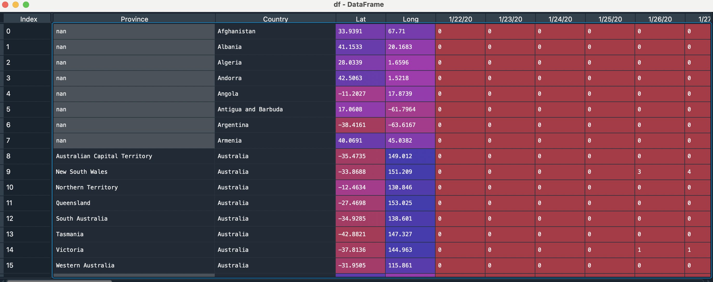

<div id="top"></div>

<!-- PROJECT SHIELDS -->
<!--
*** I'm using markdown "reference style" links for readability.
*** Reference links are enclosed in brackets [ ] instead of parentheses ( ).
*** See the bottom of this document for the declaration of the reference variables
*** for contributors-url, forks-url, etc. This is an optional, concise syntax you may use.
*** https://www.markdownguide.org/basic-syntax/#reference-style-links
-->


<!-- PROJECT LOGO -->
<br />

<h3 align="center">COVID-19 Visualization </h3>

  <p align="center">
  
<!-- TABLE OF CONTENTS -->
<details>
  <summary>Table of Contents</summary>
  <ol>
    <li>
      <a href="#about-the-project">About The Project</a>
      <ul>
        <li><a href="#built-with">Built With</a></li>
      </ul>
    </li>
    <li><a href="#Dataset">Dataset</a></li>
    <li>
      <a href="#prerequisites">Prerequisites</a>
    </li>
    <li><a href="#Contributing">Contributing</a></li>
    <li><a href="#license">License</a></li>
    <li><a href="#contact">Contact</a></li>
  </ol>
</details>

<!-- ABOUT THE PROJECT -->

## About The Project

This small project is dedicated to illustrate the COVID-19 Cases distribution among the different nations using the 
  
    - Scatter Maps  
    - Choropleth Maps 
  
in the Plotly libraries.
  
### Dataset
  
Here, i have used the Novel_Corona_Virus_Dataset to sort the data and implement it on the different representations of the Plotly.
<hr>  
  
<p> Download DataSet </p>

<a href="https://www.kaggle.com/sudalairajkumar/novel-corona-virus-2019-dataset"> Novel Corona Virus Data Set </a>
 
<p align="right">(<a href="#top">back to top</a>)</p>


### Built With

- [Jupyter Notebook](https://jupyter.org/)
- [Python](https://www.python.org/)

<p align="right">(<a href="#top">back to top</a>)</p>


<!-- Prerequisites -->

### Prerequisites

This are the required libraies to install before running the program on your computer locally.
They are available in the following links.

Python Plotly

```sh
https://plotly.com/python/
```

Python Pandas

```sh
https://pandas.pydata.org/
```

<!-- CONTRIBUTING -->

## Contributing

Contributions are what make the open source community such an amazing place to learn, inspire, and create. Any contributions you make are **greatly appreciated**.

If you have a suggestion that would make this better, please fork the repo and create a pull request. You can also simply open an issue with the tag "enhancement".
Don't forget to give the project a star! Thanks you!


1. Commit your Changes 
2. Push to the Branch 
3. Open a Pull Request

<p align="right">(<a href="#top">back to top</a>)</p>


<!-- LICENSE -->

## License

Distributed under the MIT License. See `LICENSE.txt` for more information.

<p align="right">(<a href="#top">back to top</a>)</p>


<!-- CONTACT -->

## Contact

Sardorbek Madaminov - [@Linked-in](https://www.linkedin.com/in/sardorbekmadaminov-44987a1a7/Linkedin) - sardor0968@gmail.com

Project Link: [https://github.com/Sardor-M/OSS_Term_Project.git)

<p align="right">(<a href="#top">back to top</a>)</p>


<!-- MARKDOWN LINKS & IMAGES -->
<!-- https://www.markdownguide.org/basic-syntax/#reference-style-links -->

